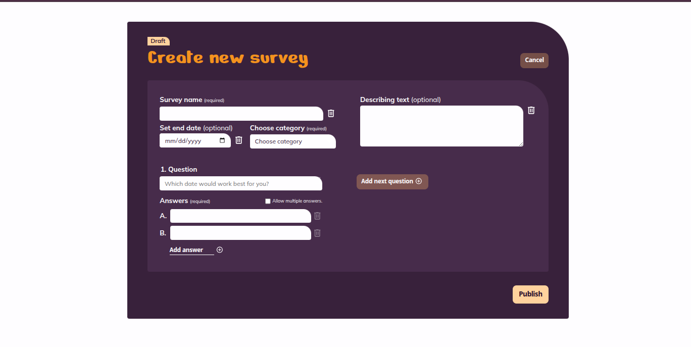
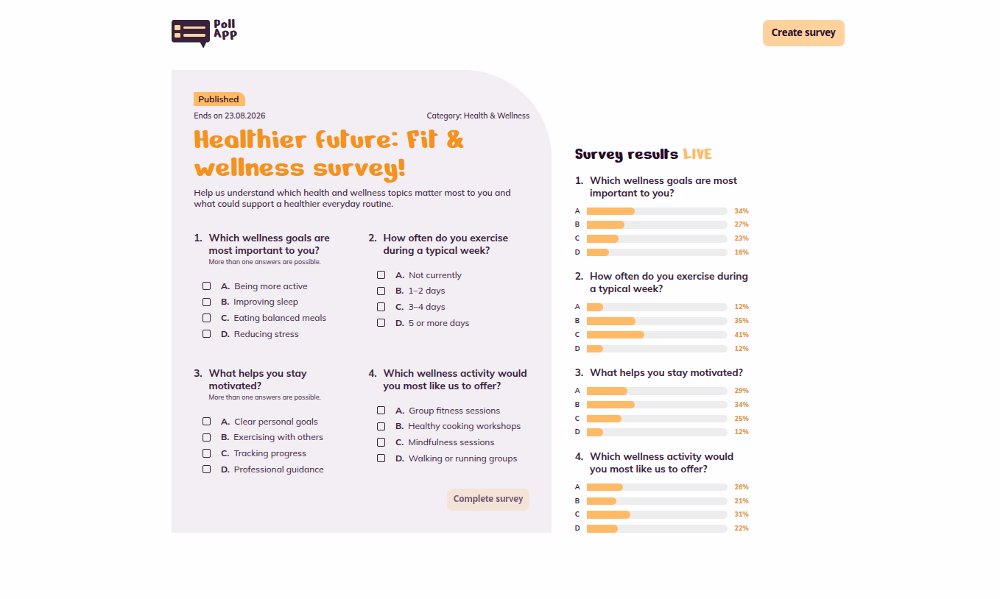

# PollApp

PollApp is a responsive Angular survey application for creating polls, collecting anonymous votes,
and watching aggregate results update live through Supabase.

**Live application:** [obo-wan.github.io/PollApp](https://obo-wan.github.io/PollApp/)

## Application preview


<table>
  <tr>
    <td width="50%">
      
    </td>
    <td width="50%">
      
    </td>
  </tr>
  <tr>
    <td align="center"><strong>Create a survey</strong></td>
    <td align="center"><strong>Vote and follow live results</strong></td>
  </tr>
</table>

<p align="center">
  
  <br />
  <strong>Responsive mobile layout</strong>
</p>

## Checklist coverage

The five functional user stories from the Poll-App project checklist are implemented:

| User story         | Implementation                                                                                  |
| ------------------ | ----------------------------------------------------------------------------------------------- |
| Ending soon        | Active surveys are ordered chronologically by their deadline.                                   |
| Survey overview    | Active and past surveys can be browsed and filtered by category.                                |
| Create survey      | The form supports questions, answers, categories, optional deadlines, and validation.           |
| Survey details     | Published surveys show their questions, answer options, metadata, and current results.          |
| Voting and results | Anonymous votes persist transactionally and aggregate results update through Supabase Realtime. |

## Technical highlights

- Angular 22 standalone components with strict TypeScript configuration.
- Responsive desktop, tablet, and mobile layouts based on the supplied Figma designs.
- Supabase Postgres migrations, row-level security, transactional RPCs, seed data, and pgTAP tests.
- Browser-safe runtime configuration for local development and GitHub Pages deployment.
- Fixture fallback for unavailable reads without disguising failed configured writes.
- Hash-based routing so GitHub Pages survey links remain reload-safe.
- Vitest unit tests and Playwright browser coverage for the principal workflows and viewports.

## Development server

Start the local Supabase stack and apply its seed data:

```bash
npm run supabase:start
npm run supabase:reset
npm start
```

`npm start` writes a browser-safe runtime configuration from `supabase status -o env`, then
starts Angular. Open `http://localhost:4200/`. If Supabase becomes unavailable, the application
keeps working with fixture surveys and displays a fallback notice.

## Code scaffolding

Angular CLI includes powerful code scaffolding tools. To generate a new component, run:

```bash
ng generate component component-name
```

For a complete list of available schematics (such as `components`, `directives`, or `pipes`), run:

```bash
ng generate --help
```

## Building

To build the project run:

```bash
ng build
```

This will compile your project and store the build artifacts in the `dist/` directory. By default, the production build optimizes your application for performance and speed.

### GitHub Pages runtime configuration

GitHub Pages uses hash-based Angular routes, such as
`https://obo-wan.github.io/PollApp/#/surveys/1`. The fragment stays in the browser, so opening or
refreshing a survey requests the `/PollApp/` root document with HTTP 200 instead of requesting a
nested path that GitHub Pages cannot rewrite. Local development uses the same route format, such as
`http://localhost:4200/#/surveys/1`.

The GitHub Pages workflow generates `supabase-config.json` during the production build. Configure
these repository variables under **Settings > Secrets and variables > Actions > Variables** before
deploying:

| Variable                           | Value                                                 |
| ---------------------------------- | ----------------------------------------------------- |
| `POLLAPP_SUPABASE_URL`             | Hosted project URL, such as `https://ref.supabase.co` |
| `POLLAPP_SUPABASE_PUBLISHABLE_KEY` | Browser-safe `sb_publishable_...` or legacy anon key  |

The generated file is copied into the GitHub Pages artifact and remains Git-ignored locally. The
configuration writer rejects non-HTTP URLs and keys that are not browser-safe, so a missing or
unsafe configuration fails the deployment instead of publishing a misconfigured application.

Never use a secret or service-role key in Angular, GitHub repository variables, or
`public/supabase-config.json`. Browser access is authorized by the publishable key and constrained
by the database grants and row-level security policies in `supabase/migrations/`.

## Verification

Run formatting, unit tests, and an Angular build together:

```bash
npm run verify
```

Run the complete Playwright suite:

```bash
npm run test:e2e
```

The Playwright suite covers the principal survey workflows and responsive viewports.

## Supabase database

The database contract lives in [`supabase/`](supabase/README.md). It includes:

- relational survey, question, answer, vote, and result tables;
- transactional functions for creating surveys and submitting votes;
- anonymous read policies with writes restricted to those functions;
- seed data matching the current Angular survey fixtures.

Angular reads surveys from the configured Data API through `@supabase/supabase-js`, with fixture
fallback when reads are unavailable. When Supabase is configured, survey creation and vote
submission use the transactional database functions and never fall back to fixture writes. Vote
submission uses a stable UUID stored only in the browser for best-effort duplicate prevention; it
does not enable Angular authentication or session persistence.

Configured clients also subscribe to anonymous Realtime updates from the public aggregate
`answer_results` table, so an open survey result view updates when another browser submits a vote.

To start a clean local database, apply the migrations and seed, and run the database tests:

```bash
npm run supabase:verify
```

Docker must be installed and running. See [`supabase/README.md`](supabase/README.md) for local and hosted-project setup.

Run the focused browser integration after the local stack has started:

```bash
npm run test:e2e:supabase
```

## Additional resources

For more information on using the Angular CLI, including detailed command references, visit the [Angular CLI Overview and Command Reference](https://angular.dev/tools/cli) page.
